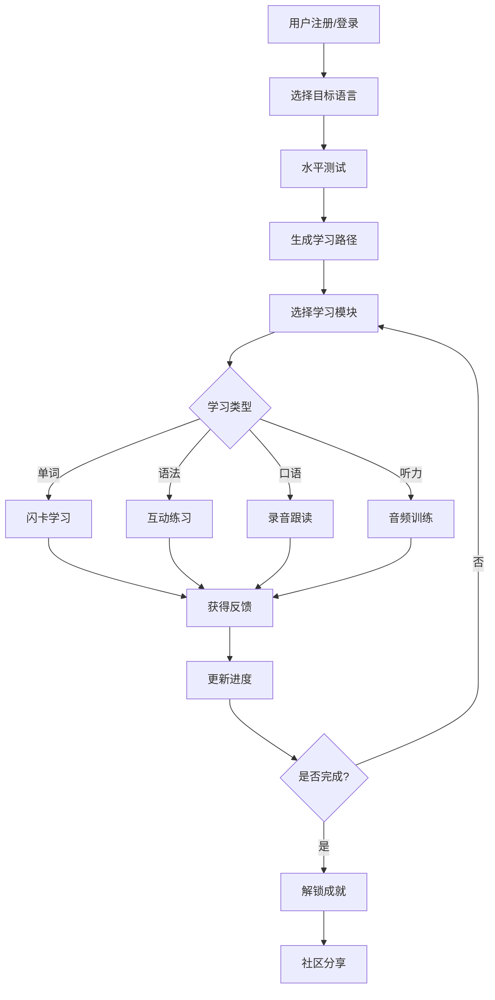

# LinguaFlow 多语种在线教育平台 - 产品需求文档

## 1. 产品概述

LinguaFlow 是一款沉浸式多语种在线学习平台，支持英语、日语、韩语等主流语言学习。平台通过分级课程体系、互动式学习模块和个性化学习路径，帮助用户高效掌握外语技能，打造愉悦的学习体验。

**核心价值**: 让语言学习变得有趣、高效、个性化

---

## 2. 核心功能

### 2.1 用户角色

| 角色 | 注册方式 | 核心权限 |
|------|----------|----------|
| 普通用户 | 邮箱/手机号注册 | 学习课程、追踪进度、参与社区 |
| VIP用户 | 订阅升级 | 解锁高级课程、专属导师、无广告体验 |
| 管理员 | 后台分配 | 用户管理、数据统计、系统配置 |

### 2.2 功能模块

1. **首页**: 平台介绍、课程推荐、学习入口、用户成就展示
2. **课程中心**: 分级课程列表、课程详情、学习路径
3. **学习模块**: 单词记忆、语法练习、口语跟读、听力训练
4. **个人中心**: 学习进度、成就徽章、学习计划、账户设置
5. **社区**: 学习交流、问答互助、学习打卡、排行榜
6. **管理后台**: 用户管理、数据统计、系统配置（仅管理员可访问）

### 2.3 页面详情

| 页面名称 | 模块名称 | 功能描述 |
|----------|----------|----------|
| 首页 | Hero区域 | 动态展示平台特色，吸引用户注册 |
| 首页 | 课程预览 | 展示热门课程和学习路径入口 |
| 首页 | 成就展示 | 滚动展示用户获得的成就徽章 |
| 侧边导航 | 可折叠侧边栏 | 支持展开/收起，展开宽度256px，收起宽度80px，收起状态显示图标和tooltip |
| 课程中心 | 语言选择 | 英语/日语/韩语等语言切换 |
| 课程中心 | 分级体系 | A1/A2/B1/B2/C1/C2 六级分类 |
| 课程中心 | 课程列表 | 卡片式展示各等级课程 |
| 学习模块 | 单词记忆 | 闪卡式单词学习，支持发音 |
| 学习模块 | 语法练习 | 选择题、填空题互动练习 |
| 学习模块 | 口语跟读 | 录音对比、AI评分反馈 |
| 学习模块 | 听力训练 | 音频播放、听写练习 |
| 个人中心 | 学习数据 | 学习时长、完成课程、掌握单词数 |
| 个人中心 | 进度追踪 | 可视化进度条、学习日历 |
| 个人中心 | 成就系统 | 徽章墙、等级体系 |
| 社区 | 讨论区 | 话题分类、发帖回帖 |
| 社区 | 排行榜 | 学习时长榜、连续打卡榜 |
| 社区 | 学习小组 | 兴趣小组、组队学习 |
| 管理后台 | 仪表盘 | 总用户数、活跃用户、学习时长统计、新增用户趋势 |
| 管理后台 | 用户管理 | 用户列表、搜索筛选、禁用/启用用户、修改用户角色、删除用户 |

---

## 3. 核心流程

### 3.1 用户学习流程

用户注册/登录 → 选择目标语言 → 水平测试定级 → 获得个性化学习路径 → 开始学习模块 → 完成练习获得反馈 → 追踪学习进度 → 解锁成就徽章 → 参与社区互动

### 3.2 学习流程图

---

## 4. 用户界面设计

### 4.1 设计风格

**整体风格**: 现代简约 + 活力渐变

- **主色调**: 
  - 主色: #6366F1 (靛蓝紫) - 代表智慧与学习
  - 辅色: #F59E0B (琥珀金) - 代表成就与激励
  - 背景: #0F172A (深蓝黑) - 沉浸式深色主题
  - 卡片: #1E293B ( slate灰) - 层次区分

- **按钮样式**: 
  - 主按钮: 渐变背景 (靛蓝→紫色) + 圆角12px + 微阴影
  - 次按钮: 透明背景 + 边框 + 悬停填充效果

- **字体**:
  - 标题: "Outfit" - 现代几何无衬线字体
  - 正文: "Plus Jakarta Sans" - 清晰易读
  - 中文: "Noto Sans SC" - 思源黑体

- **布局风格**: 
  - 卡片式布局
  - 左侧固定导航
  - 内容区域自适应
  - 玻璃拟态效果

- **图标风格**: 
  - Lucide 图标库
  - 线性风格
  - 统一 24px 尺寸

### 4.2 页面设计概览

| 页面名称 | 模块名称 | UI元素 |
|----------|----------|--------|
| 首页 | Hero区域 | 动态渐变背景、浮动语言图标、打字机动画标题 |
| 首页 | 特性展示 | 3D翻转卡片、悬停放大效果 |
| 首页 | 课程预览 | 横向滚动卡片、进度指示器 |
| 课程中心 | 语言切换 | 标签页切换、国旗图标 |
| 课程中心 | 课程卡片 | 封面图、难度标签、学习人数、进度条 |
| 学习模块 | 单词卡片 | 3D翻转效果、发音按钮、记忆标记 |
| 学习模块 | 练习界面 | 选项卡片、即时反馈动画 |
| 个人中心 | 数据面板 | 环形进度图、统计数字动画 |
| 个人中心 | 徽章墙 | 网格布局、悬停详情、解锁动画 |
| 社区 | 讨论列表 | 头像、标签、点赞评论数 |

### 4.3 响应式设计

- **桌面端**: 左侧可折叠导航 + 主内容区 (1440px+)
  - 展开状态：宽度 256px，显示完整导航项和标签
  - 收起状态：宽度 80px，仅显示图标，悬停显示 tooltip
  - 折叠状态持久化存储到 LocalStorage
- **平板端**: 顶部导航 + 内容区 (768px-1439px)
- **移动端**: 底部标签栏 + 单列布局 (<768px)

### 4.4 动效设计

- **页面加载**: 元素依次淡入 + 上滑 (stagger 100ms)
- **滚动触发**: 卡片进入视口时缩放 + 透明度变化
- **交互动画**:
  - 按钮悬停: 缩放1.05 + 阴影加深
  - 卡片悬停: 上浮8px + 边框发光
  - 完成练习:  confetti 庆祝动画
- **微交互**: 
  - 切换开关: 弹性动画
  - 加载状态: 骨架屏 + 脉冲效果
  - 成功反馈: 对勾动画 + 绿色光晕

---

## 5. 功能规格

### 5.1 分级课程体系

- **A1 初级**: 基础词汇、简单句型、日常对话
- **A2 初中级**: 扩展词汇、基础语法、情景对话
- **B1 中级**: 复杂语法、短文阅读、观点表达
- **B2 中高级**: 专业词汇、长文阅读、流利对话
- **C1 高级**: 学术语言、文化理解、深度讨论
- **C2 精通**: 母语水平、专业领域、文化 nuances

### 5.2 互动学习模块

**单词记忆**:
- 闪卡正反面翻转
- 间隔重复算法
- 发音播放 (TTS)
- 收藏/标记难度

**语法练习**:
- 选择题 (单选/多选)
- 填空题 (拖拽/输入)
- 句子排序
- 即时解析反馈

**口语跟读**:
- 原音播放
- 录音对比
- AI发音评分
- 波形可视化

**听力训练**:
- 音频播放控制
- 听写输入
- 变速播放
- 原文对照

### 5.3 学习进度追踪

- 学习时长统计 (日/周/月)
- 完成课程进度
- 掌握单词数量
- 连续学习天数
- 能力雷达图
- 学习日历热力图

### 5.4 个性化推荐

- 基于水平测试的初始路径
- 根据学习数据动态调整
- 薄弱点强化推荐
- 兴趣标签匹配
- 学习时间安排建议

### 5.5 社区与成就

**成就系统**:
- 首次学习、连续打卡、完成课程
- 单词达人、语法大师、口语之星
- 社区贡献者、帮助达人

**社区功能**:
- 话题讨论区
- 问答互助
- 学习打卡
- 排行榜 (周/月/总榜)
- 学习小组

---

## 6. 技术要求

### 6.1 性能指标

- 首屏加载 < 2s
- 交互响应 < 100ms
- 动画帧率 60fps
- 支持离线学习

### 6.2 兼容性

- Chrome 90+, Firefox 88+, Safari 14+, Edge 90+
- 响应式支持 320px - 2560px
- 支持 PWA 安装

### 6.3 无障碍

- WCAG 2.1 AA 标准
- 键盘导航支持
- 屏幕阅读器兼容
- 高对比度模式
