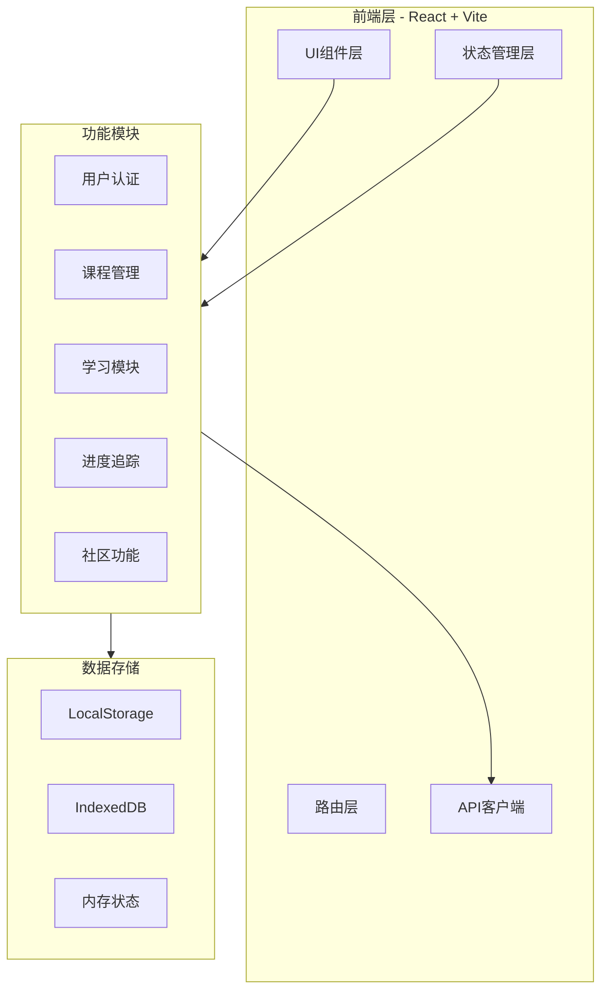
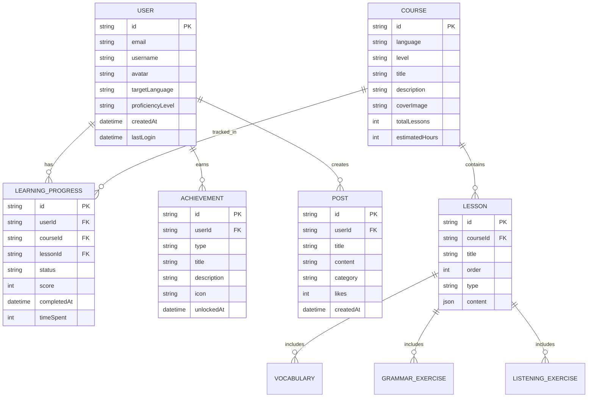

# LinguaFlow 技术架构文档

## 1. 架构设计



---

## 2. 技术栈描述

### 2.1 核心技术

| 类别 | 技术 | 版本 | 用途 |
|------|------|------|------|
| 框架 | React | 18.x | UI组件开发 |
| 构建 | Vite | 5.x | 项目构建与开发服务器 |
| 语言 | TypeScript | 5.x | 类型安全开发 |
| 样式 | Tailwind CSS | 3.x | 原子化CSS样式 |
| 路由 | React Router | 6.x | 单页应用路由 |
| 状态 | Zustand | 4.x | 全局状态管理 |
| 动画 | Framer Motion | 11.x | 交互动画效果 |
| 图标 | Lucide React | latest | 图标库 |
| 图表 | Recharts | 2.x | 数据可视化 |

### 2.2 开发工具

- **ESLint**: 代码质量检查
- **Prettier**: 代码格式化
- **TypeScript**: 类型检查
- **Vite PWA**: PWA支持

---

## 3. 路由定义

| 路由 | 用途 | 权限 |
|------|------|------|
| / | 首页/landing page | 公开 |
| /login | 登录页面 | 公开 |
| /register | 注册页面 | 公开 |
| /dashboard | 用户仪表盘 | 需登录 |
| /courses | 课程中心 | 需登录 |
| /courses/:id | 课程详情 | 需登录 |
| /learn/:type | 学习模块 | 需登录 |
| /profile | 个人中心 | 需登录 |
| /community | 社区 | 需登录 |
| /leaderboard | 排行榜 | 需登录 |
| /admin | 管理仪表盘 | 需管理员权限 |
| /admin/users | 用户管理 | 需管理员权限 |

---

## 4. 数据模型

### 4.1 实体关系图



### 4.2 TypeScript 类型定义

```typescript
// 用户类型
interface User {
  id: string;
  email: string;
  username: string;
  avatar?: string;
  targetLanguage: Language;
  proficiencyLevel: ProficiencyLevel;
  role: 'user' | 'vip' | 'admin';
  createdAt: Date;
  lastLogin: Date;
  streak: number;
  totalStudyTime: number;
  isActive: boolean;
}

type Language = 'english' | 'japanese' | 'korean';
type ProficiencyLevel = 'A1' | 'A2' | 'B1' | 'B2' | 'C1' | 'C2';

// 课程类型
interface Course {
  id: string;
  language: Language;
  level: ProficiencyLevel;
  title: string;
  description: string;
  coverImage: string;
  totalLessons: number;
  estimatedHours: number;
  lessons: Lesson[];
}

interface Lesson {
  id: string;
  courseId: string;
  title: string;
  order: number;
  type: 'vocabulary' | 'grammar' | 'listening' | 'speaking';
  content: LessonContent;
}

// 学习进度
interface LearningProgress {
  id: string;
  userId: string;
  courseId: string;
  lessonId: string;
  status: 'not_started' | 'in_progress' | 'completed';
  score: number;
  completedAt?: Date;
  timeSpent: number;
}

// 成就系统
interface Achievement {
  id: string;
  userId: string;
  type: string;
  title: string;
  description: string;
  icon: string;
  unlockedAt: Date;
}

// 社区帖子
interface Post {
  id: string;
  userId: string;
  author: User;
  title: string;
  content: string;
  category: string;
  likes: number;
  comments: Comment[];
  createdAt: Date;
}
```

---

## 5. 状态管理设计

### 5.1 Store 划分

```
src/
├── stores/
│   ├── authStore.ts      # 用户认证状态
│   ├── courseStore.ts    # 课程数据状态
│   ├── learnStore.ts     # 学习进度状态
│   ├── progressStore.ts  # 学习统计状态
│   ├── sidebarStore.ts   # 侧边栏折叠状态
│   ├── adminStore.ts     # 管理后台状态
│   └── socialStore.ts    # 社区数据状态
```

### 5.2 Auth Store 示例

```typescript
interface AuthState {
  user: User | null;
  isAuthenticated: boolean;
  isLoading: boolean;
  
  login: (email: string, password: string) => Promise<void>;
  register: (data: RegisterData) => Promise<void>;
  logout: () => void;
  updateProfile: (data: Partial<User>) => Promise<void>;
}
```

---

## 6. 组件架构

### 6.1 组件分层

```
src/
├── components/
│   ├── common/           # 通用组件
│   │   ├── Button.tsx
│   │   ├── Card.tsx
│   │   ├── Input.tsx
│   │   └── Modal.tsx
│   ├── layout/           # 布局组件
│   │   ├── Sidebar.tsx   # 可折叠侧边栏组件
│   │   ├── Header.tsx
│   │   └── MainLayout.tsx
│   ├── learn/            # 学习模块组件
│   │   ├── FlashCard.tsx
│   │   ├── QuizCard.tsx
│   │   ├── AudioPlayer.tsx
│   │   └── ProgressRing.tsx
│   ├── course/           # 课程组件
│   │   ├── CourseCard.tsx
│   │   ├── LevelBadge.tsx
│   │   └── LessonList.tsx
│   └── social/           # 社区组件
│       ├── PostCard.tsx
│       ├── CommentList.tsx
│       └── Leaderboard.tsx
├── pages/
│   ├── Home.tsx
│   ├── Courses.tsx
│   ├── Learn.tsx
│   ├── Community.tsx
│   ├── Leaderboard.tsx
│   ├── Profile.tsx
│   ├── Login.tsx
│   ├── Register.tsx
│   └── admin/
│       ├── AdminDashboard.tsx
│       └── UserManagement.tsx
```

### 6.2 组件设计原则

- **单一职责**: 每个组件只负责一个功能
- **可复用性**: 通用组件支持配置化
- **类型安全**: 所有组件使用TypeScript类型
- **性能优化**: 使用React.memo和useMemo优化

### 6.3 侧边栏折叠功能

| 功能点 | 描述 |
|--------|------|
| 状态管理 | 使用 Zustand store (sidebarStore) 管理折叠状态 |
| 持久化 | 通过 zustand/middleware persist 保存到 LocalStorage |
| 展开宽度 | 256px (w-64) |
| 收起宽度 | 80px (w-20) |
| 动画 | Framer Motion AnimatePresence 实现文字淡入淡出 |
| 图标显示 | 收起状态隐藏标签，仅保留图标 + tooltip |
| 切换按钮 | 侧边栏右侧垂直居中位置，带有 chevron 图标 |

---

## 7. 本地存储策略

### 7.1 存储方案

| 数据类型 | 存储方式 | 用途 |
|----------|----------|------|
| 用户Token | LocalStorage | 持久登录状态 |
| 用户配置 | LocalStorage | 主题、语言偏好 |
| 学习进度 | IndexedDB | 大量结构化数据 |
| 缓存数据 | Memory | 临时状态 |

### 7.2 IndexedDB Schema

```typescript
// 数据库: LinguaflowDB
// 版本: 1

// Object Stores:
- users: 用户信息
- courses: 课程数据
- lessons: 课程内容
- progress: 学习进度
- achievements: 成就数据
- posts: 社区帖子
- vocabulary: 单词数据
```

---

## 8. 动画实现方案

### 8.1 动画库选择

- **Framer Motion**: 组件动画、页面过渡、手势交互
- **CSS Animations**: 简单hover效果、加载动画
- **Canvas Confetti**: 成就庆祝效果

### 8.2 关键动画场景

| 场景 | 实现方式 | 效果描述 |
|------|----------|----------|
| 页面进入 | Framer Motion | stagger淡入 + 上滑 |
| 卡片悬停 | CSS + Framer | 上浮 + 发光边框 |
| 单词翻转 | Framer Motion | 3D Y轴翻转 |
| 进度更新 | Framer Motion | 数字滚动 + 环形填充 |
| 成就解锁 | Canvas Confetti | 彩纸爆炸效果 |
| 路由切换 | Framer Motion | 淡入淡出过渡 |
| 侧边栏折叠 | CSS Transition + Framer AnimatePresence | 宽度变化 + 文字淡入淡出 |

---

## 9. 项目文件结构

```
linguaflow/
├── public/
│   ├── images/           # 静态图片资源
│   ├── icons/            # 图标资源
│   └── manifest.json     # PWA配置
├── src/
│   ├── assets/           # 项目资源
│   ├── components/       # 组件
│   ├── hooks/            # 自定义Hooks
│   ├── stores/           # 状态管理
│   ├── types/            # TypeScript类型
│   ├── utils/            # 工具函数
│   ├── data/             # 模拟数据
│   ├── pages/            # 页面组件
│   ├── App.tsx
│   └── main.tsx
├── index.html
├── package.json
├── tsconfig.json
├── vite.config.ts
├── tailwind.config.js
└── eslint.config.js
```

---

## 10. 开发规范

### 10.1 代码规范

- 使用函数组件 + Hooks
- 组件名使用PascalCase
- 文件名与组件名一致
- Props使用接口定义
- 事件处理函数以handle开头

### 10.2 样式规范

- 使用Tailwind CSS工具类
- 自定义样式使用CSS Modules
- 主题色使用CSS Variables
- 响应式使用Tailwind断点

### 10.3 提交规范

- feat: 新功能
- fix: 修复bug
- docs: 文档更新
- style: 样式调整
- refactor: 重构
- test: 测试相关
